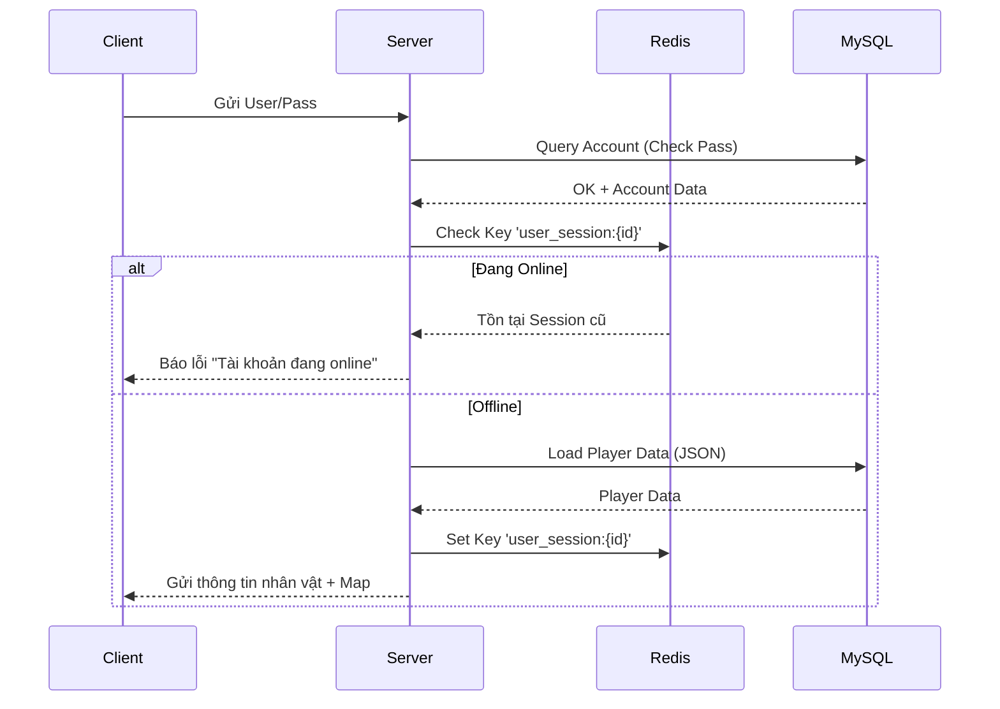
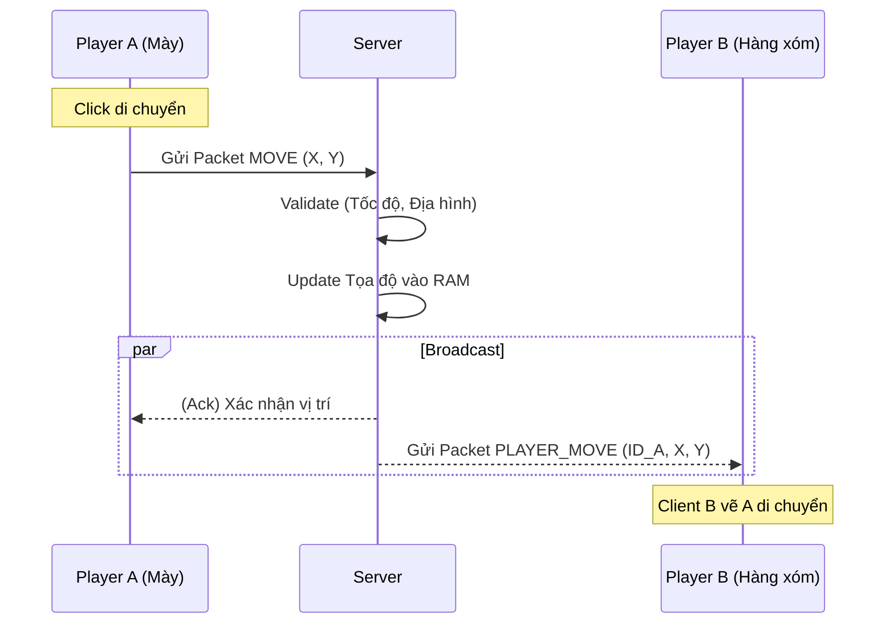

# Cơ chế hoạt động Client - Server & Redis Cache

Tài liệu này giải thích chi tiết về luồng dữ liệu (Data Flow), giao thức giao tiếp và vai trò của Redis trong hệ thống Game Server Arriety.

## 1. Giao thức & Kết nối (Protocol)

Hệ thống sử dụng mô hình **Stateful Real-time** với giao thức **TCP/IP**.

*   **Socket Connection:** Kết nối giữa Client và Server được duy trì liên tục (Persistent Connection) trong suốt quá trình chơi.
*   **Packet Structure:** Giao tiếp thông qua các gói tin binary:
    *   `[Message Type]` (1 byte): Định nghĩa loại tin nhắn.
    *   `[Command ID]` (1 byte): Mã lệnh chức năng (VD: -127 Login, -7 Attack).
    *   `[Payload]` (Byte Array): Dữ liệu chi tiết.

### Sơ đồ lớp Server (Server Layers)

```mermaid
graph TD
    Client[Unity Client] <-->|TCP Socket| Network[Network Layer (Session)]
    Network <-->|Dispatch| Controller[Controller Layer (Handler)]
    Controller -->|Call| Service[Service Layer (Logic)]
    Service -->|Read/Write| RAM[In-Memory Data]
    Service -->|Sync (Periodic)| DB[(MySQL Database)]
    Service <-->|Cache/Session| Redis[(Redis Cache)]
```

---

## 2. Luồng xử lý Logic (Workflow)

### A. Quy trình Đăng nhập (Login Flow)
Sử dụng Redis để kiểm tra trạng thái Online và chống login đè.



### B. Quy trình Tương tác (Di chuyển/Đánh quái)
Sử dụng cơ chế **Broadcast** để đồng bộ trạng thái cho người chơi khác.



---

## 3. Vai trò của Redis

Trong hệ thống Arriety, Redis đóng vai trò là lớp đệm (Cache & Session Store) giúp giảm tải cho MySQL.

### Các chức năng chính:
1.  **Session Management (Quản lý Phiên):**
    *   Lưu trạng thái đăng nhập của User.
    *   Key: `user_session:{account_id}`.
    *   Tác dụng: Ngăn chặn 1 tài khoản đăng nhập trên 2 máy cùng lúc.

2.  **Leaderboard (Bảng Xếp Hạng Real-time):**
    *   Sử dụng **Redis Sorted Set (ZSET)**.
    *   Khi chỉ số sức mạnh thay đổi -> Update ngay vào Redis (`ZADD`).
    *   Lấy Top 100 -> Query Redis (`ZREVRANGE`) cực nhanh, không cần `SELECT ORDER BY` trong SQL.

3.  **Data Caching (Bộ đệm dữ liệu nóng):**
    *   Lưu các thông tin ít thay đổi nhưng được truy cập nhiều: Danh sách Shop, Thông tin Clan cơ bản.

### Mô hình Lưu trữ (Persistence Strategy)
*   **Hot Data (RAM/Redis):** Máu, Mana, Vị trí, Exp thay đổi liên tục -> Chỉ xử lý trên RAM/Redis.
*   **Cold Data (MySQL):** Định kỳ (Auto-save 5-10p) hoặc khi Logout -> Server mới ghi dữ liệu từ RAM xuống MySQL.

> **Lợi ích:** Giúp ổ cứng không bị quá tải IOPS do việc update liên tục của hàng nghìn người chơi.
